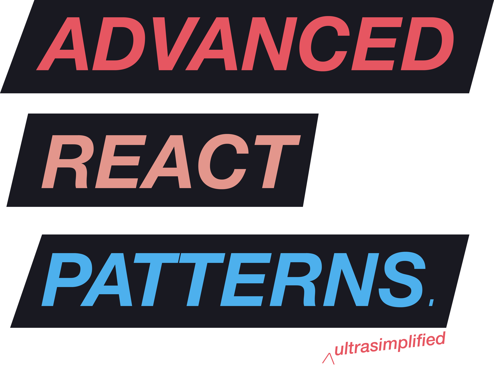

<h1 align='center'>Center of Excellence (CoE): JS</h1>
<h2 align='center'>Juan Manuel Acuña</h2>
<h3 align='center'>Think twice, code once</h3>

  

<h3 align='center'>Advanced React Patterns</h3>
<h4 align='center'>By: Ohans Emmanuel</h4>
<h4 align='center'>https://www.udemy.com/course/the-complete-guide-to-advanced-react-patterns/</h4>

## Notes

  

In software engineering, a software design pattern is a general, reusable solution to a commonly occurring problem within a given context in software design. It is not a finished design that can be transformed directly into source or machine code. Rather, it is a description or template for how to solve a problem that can be used in many different situations. Design patterns are formalized best practices that the programmer can use to solve common problems when designing an application or system.

### Hooks and Custom hooks

- With the custom hooks, the main logic is now transferred into a custom hook. This hook is accessible by the user and exposes several internal logics (States, Handlers), allowing him to have better control over your component.
  - Give more control: The user can insert his own logic between the hook and the JSX element, allowing him to modify the default component behavior.
  - Implementation complexity: Since the logic part is separated from the rendering part, it is the user who must link both. A good understanding of how your component work is required to correctly implement it.

### Compound Components

- Allow much more (and simplier) customizability
- An understandable API
- Props overload
- This pattern allows creating expressive and declarative components, without unnecessary prop drilling. You should consider using this pattern if you want to make your component more customizable, with a better separation of concern and an understandable API.
- Public libraries using this pattern:
  - [React Bootstrap](https://react-bootstrap.github.io/components/dropdowns/)
  - [Reach UI](https://reach.tech/accordion)

### Reusable styles

- Strictly talking, it's not an advanced React pattern by itself, but is needed and useful

### Control props pattern

### The props collection pattern

### The props getters pattern

- Custom hook pattern gives great control, but makes also your component harder to integrate because the user has to deal with a lot of native hook’s props and recreate the logic on his side. The Props Getters Pattern pattern attempts to mask this complexity. Instead of exposing native props, we provide a shortlist of props getters. A getter is a function that returns many props, it has a meaningful name allowing the user to naturally link it to the right JSX element.

### The state initialiser pattern

### The state reducer pattern

<!-- This guy is from Nigeria!! -->
