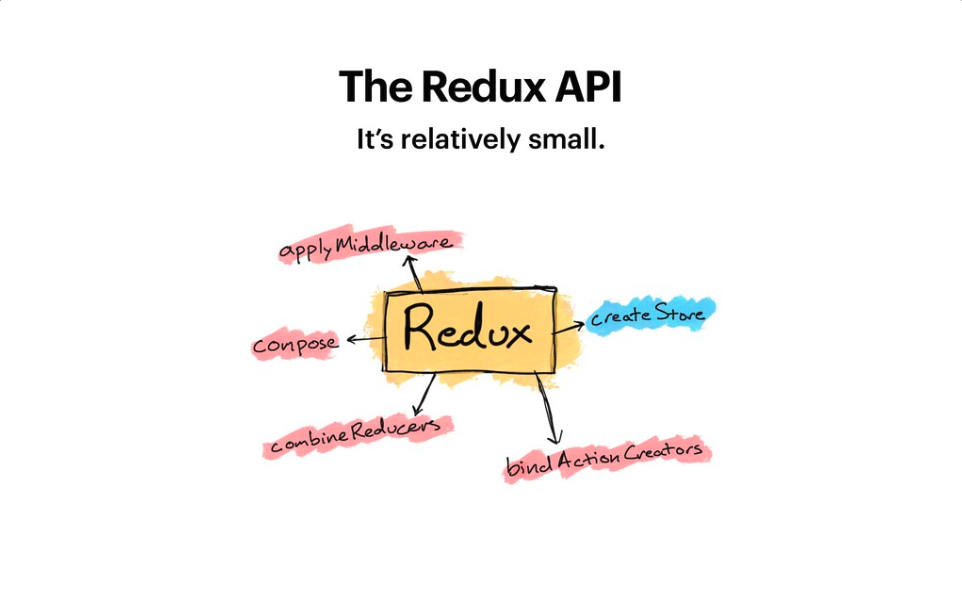
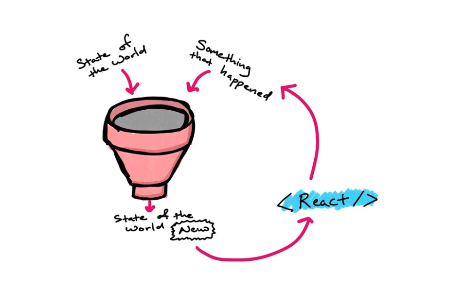
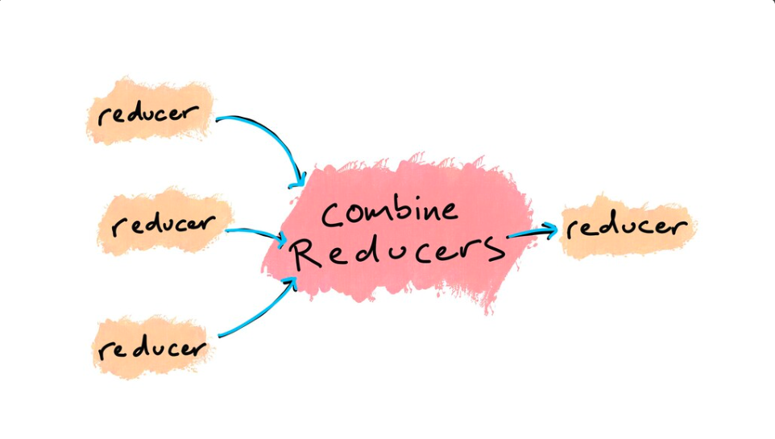
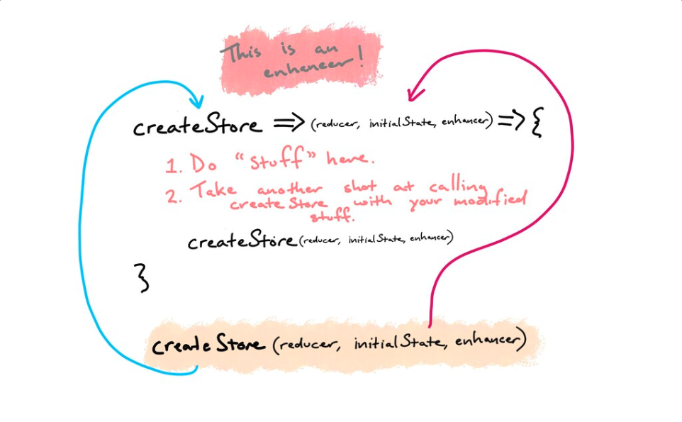
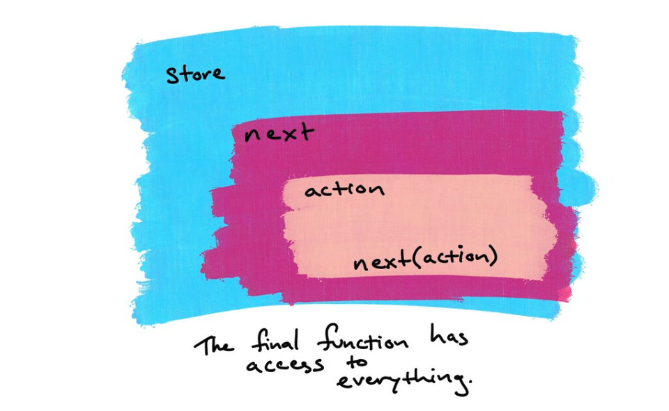

<h1 align='center'>Center of Excellence (CoE): JS</h1>
<h2 align='center'>Juan Manuel Acuña</h2>
<h3 align='center'>Think twice, code once</h3>

  

<h3 align='center'>Redux Fundamentals</h3>
<h4 align='center'>By: Steve Kinney</h4>
<h4 align='center'>https://frontendmasters.com/courses/redux-fundamentals/</h4>

## Index

### Redux without React

##### [Redux without React](https://github.com/Unosquare-CoE-JavaScript/juan-manuel-acuna/tree/training/Redux-fundamentals/course/01_redux_without_react)

##### [Hooking it up with React](https://github.com/Unosquare-CoE-JavaScript/juan-manuel-acuna/tree/training/Redux-fundamentals/course/02-hooking-it-up-with-react)

##### [Connecting Redux with React](https://github.com/Unosquare-CoE-JavaScript/juan-manuel-acuna/tree/training/Redux-fundamentals/course/03-connecting-redux-to-react)

##### [Redux toolkit and State Slices](https://github.com/Unosquare-CoE-JavaScript/juan-manuel-acuna/tree/training/Redux-fundamentals/course/04-redux-toolkit-and-state-slices)

##### [Starwars Redux](https://github.com/Unosquare-CoE-JavaScript/juan-manuel-acuna/tree/training/Redux-fundamentals/course/05-starwars-redux)

##### [Dog Facts](https://github.com/Unosquare-CoE-JavaScript/juan-manuel-acuna/tree/training/Redux-fundamentals/course/06-dog-facts)

### Some important notes

#### It´s relatively small

  

It has 5 (formal) methods ... but the "_createStore_" method has also 4 more, so, really there are 9 methods.

- applyMiddleware
- compose
- combineReducers
- bindActionCreators
- createStore

### Some rules for Reducers

##### Disobey at your own peril

- No mutating objects. If you touch it, you replace it.
- You have to return _something_ and ideally, it should be the uchanged state if there is nothing you need to do it.
- It's just a JavaScript function.

**_It's an anti pattern to have multiple stores (but we might split up into many reducers)._** **So, don't do that.**

  

  

  

  

