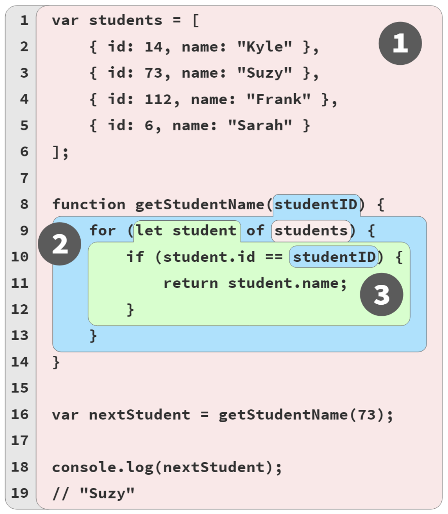
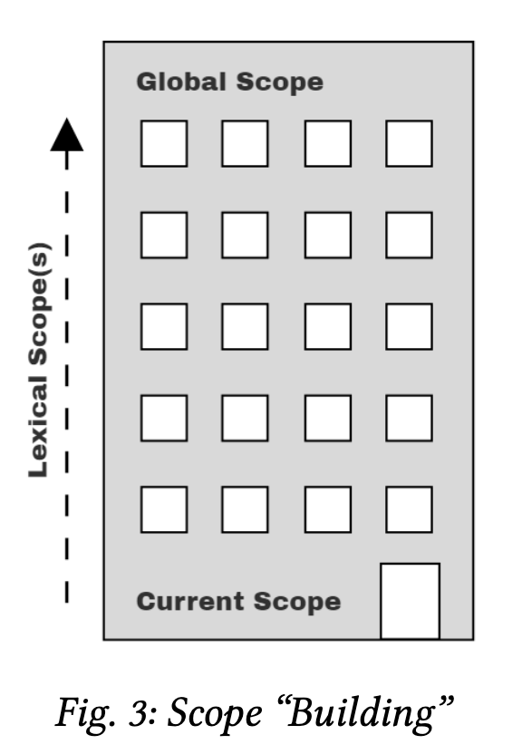

# Chapter 2: Illustrating Lexical Scope

#### Marbles, and Buckets, and Bubbles... Oh My!

```jsx
// outer/global scope: RED
var students = [
  { id: 14, name: "Kyle" },
  { id: 73, name: "Suzy" },
  { id: 112, name: "Frank" },
  { id: 6, name: "Sarah" },
];
function getStudentName(studentID) {
  // function scope: BLUE
  for (let student of students) {
    // loop scope: GREEN
    if (student.id == studentID) {
      return student.name;
    }
  }
}
var nextStudent = getStudentName(73);
console.log(nextStudent); // Suzy
```

We’ve designated three scope colors with code comments: RED (outermost global scope), BLUE (scope of function `getStudentName(..)` ), and GREEN (scope of/inside the for loop). But it still may be difficult to recognize the boundaries of these scope buckets when looking at a code listing.

<p align="center">
  
</p>

1. **Bubble 1 (RED)** encompasses the global scope, which holds three identifiers/variables: students (line 1), get- StudentName (line 8), and nextStudent (line 16).
2. **Bubble 2 (BLUE)** encompasses the scope of the function getStudentName(..) (line 8), which holds just one identifier/variable: the parameter studentID (line 8).
3. **Bubble 3 (GREEN)** encompasses the scope of the for- loop (line 9), which holds just one identifier/variable: student (line 9).

Here, `student` (line 9) cannot be called from line 17, because it will be _undefined_. But, can be called at line 10. On the other hand, `students` can be called _everywhere_ in this program, because the RED scope wraps all the BLUE and GREEN scopes (In fact, `students` is used in line 10).

Scope bubbles are determined _during compilation_ based on where the functions/blocks of scope are written, the nesting inside each other, and so on. Each scope bubble is entirely contained within its parent scope bubble — **_a scope is never partially in two different outer scopes_**.

- Variables are declared in specific scopes.
- Any variable will appear in the scope it was declared and in any deeper nested scopes.
- The determination of the scopes happens during compilation.

#### A Conversation Among Friends

- Engine: responsible for start-to-finish compilation and execution of our JavaScript program.
- Compiler: one of Engine’s friends; handles all the dirty work of parsing and code-generation (see previous section).
- Scope Manager: another friend of Engine; collects and maintains a lookup list of all the declared variables/identifiers, and enforces a set of rules as to how these are accessible to currently executing code.

#### Nested Scope

Scopes can be lexically nested to _any arbitrary depth_ as the program defines.

Each scope gets _its own Scope Manager instance_ each time that scope is executed (one or more times). Each scope automatically has all its identifiers registered at the start of the scope being executed

If any identifier came from a var declaration (as opposed to `let/const` ), that variable is _automatically initialized to undefined_ so that it can be used; otherwise, the variable remains uninitialized and cannot be used until its full declaration-and-initialization are executed.

**_One of the key aspects of lexical scope is that any time an identifier reference cannot be found in the current scope, the next outer scope in the nesting is consulted; that process is repeated until an answer is found or there are no more scopes to consult._**

#### Lookup Failures

When Engine exhausts all _lexically available_ scopes (moving outward) and still cannot resolve the lookup of an identifier, an error condition then exists. However, depending on the mode of the program (strict-mode or not) and the role of the variable, this error condition will be handled differently.

#### Undefined Mess

- If the variable is a source, an unresolved identifier lookup is considered an undeclared (unknown, missing) variable, which always results in a ReferenceError being thrown. `Reference Error: XYZ is not defined.`. `Not defined` really means `not declared` — or, rather, `undeclared', as in a variable that has no matching formal declaration in any lexically available scope.
- If the variable is a target, and the code at that moment is running in strict-mode, the variable is considered undeclared and similarly throws a ReferenceError. `undefined` really means a variable was found (declared), but the variable otherwise has no other value in it at the moment, so it defaults to the undefined value.

```jsx
var studentName;
typeof studentName; // "undefined"
typeof doesntExist; // "undefined"
```

#### Global... What!?

```jsx
// In non-strict-mode !!!
function getStudentName() {
  // assignment to an undeclared variable :(
  nextStudent = "Suzy";
}
getStudentName();
console.log(nextStudent);
// "Suzy" -- oops, an accidental-global variable!
```

#### Building On Metaphors

<p align="center">
  
</p>
